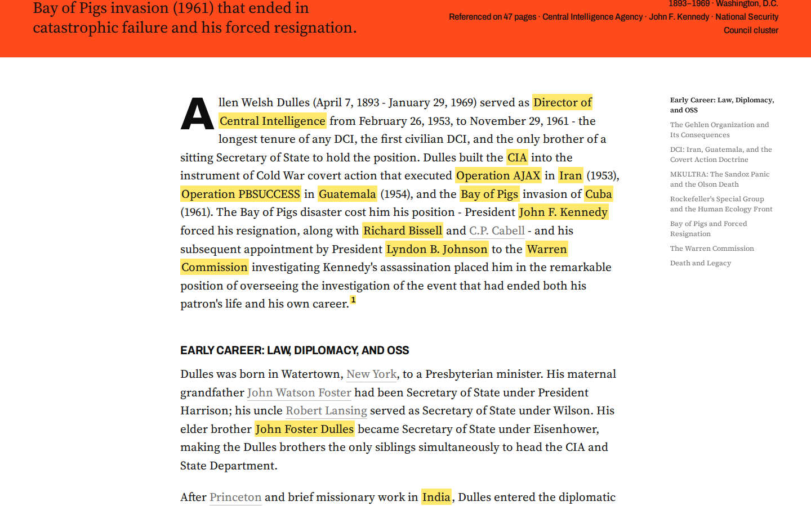
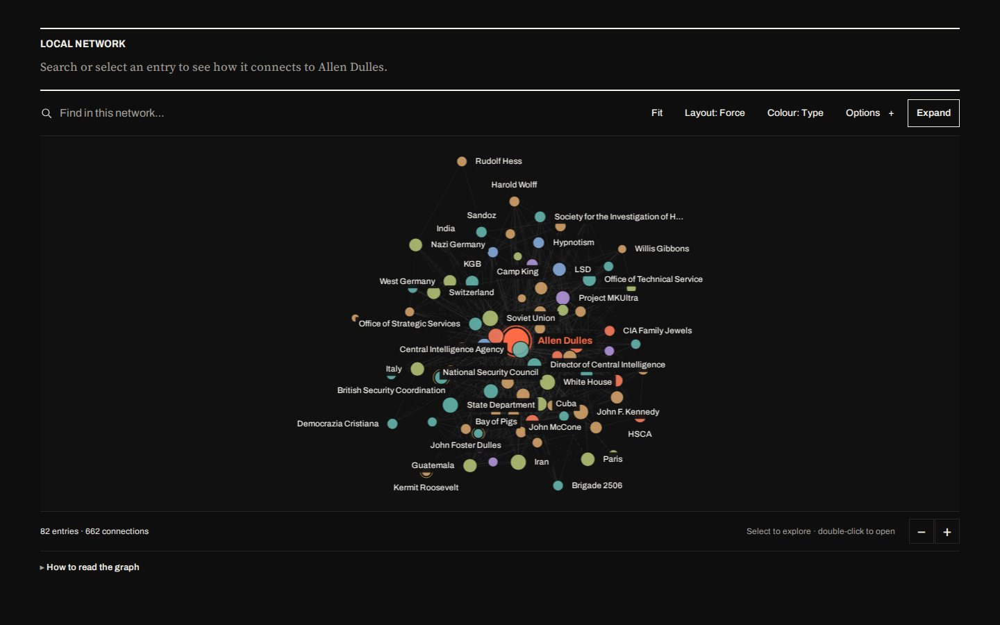
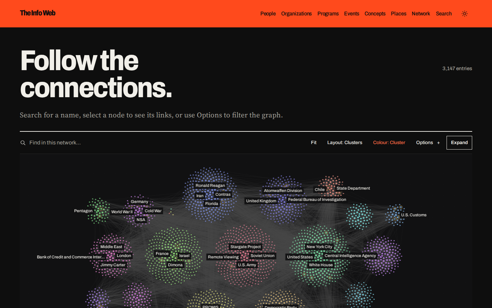
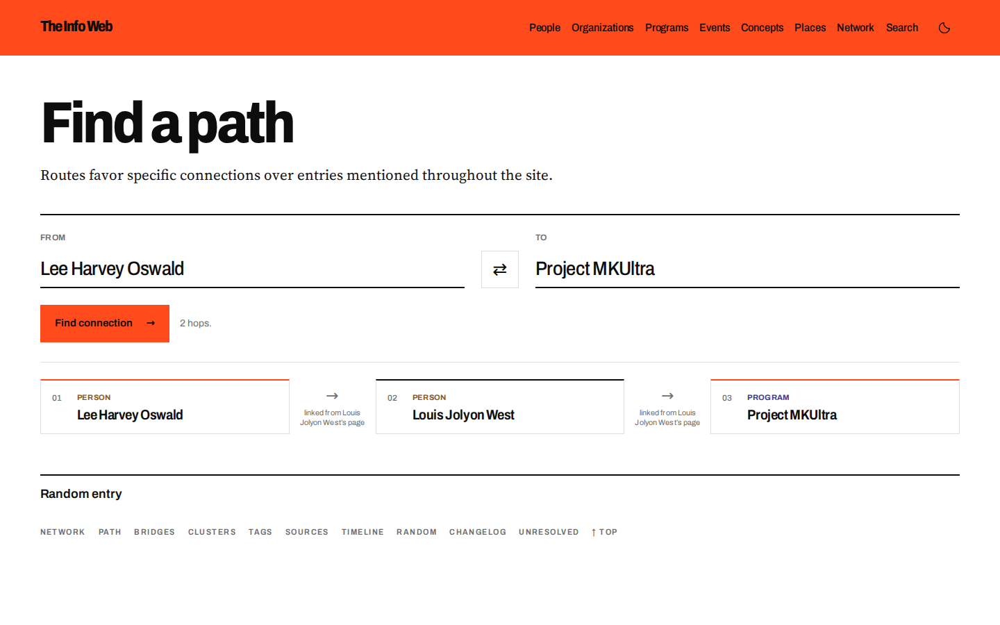

# Redthread

Turn an Obsidian vault into a website people can explore by connection.


Redthread reads a folder of linked markdown notes and builds a fast static site from it. Every note gets its own page. Every link becomes a thread you can follow, map, and trace. Keep writing in Obsidian, and the site rebuilds when your notes change.

See it live at [The Info Web](https://theinfoweb.disinfo.zone).

## What you get

- **Entry pages** with backlinks, footnote previews, a table of contents, and a local network graph.
- **The full network** of every entry on one canvas, grouped into clusters.
- **Path finding** between any two entries. It routes around the obvious hubs to find the connections that matter.
- **Hidden connections**: names that appear together but were never linked.
- **Hubs, bridges, and clusters** that show which entries hold the network together.
- **Tags, timeline, sources, and full-text search.**
- **Social cards, a sitemap, an Atom feed, and markdown copies** of every page for search engines and LLMs.
- **Plain static files.** Visitors only ever talk to nginx.

| | |
|---|---|
|  |  |
|  |  |

## Quick start

You need Docker and a vault.

```sh
git clone https://github.com/davidtorcivia/redthread.git && cd redthread
cp .env.example .env                  # set VAULT_PATH, SITE_URL, SITE_TITLE
cp config.example.json config.json    # map your folders to entry types
docker compose up -d
```

Open http://localhost:8080. The first build takes a few minutes, and after that the builder checks for changes every five minutes.

## Docs

- [Configuration](docs/configuration.md): settings, folder mapping, and the frontmatter Redthread understands.
- [Deployment](docs/deployment.md): Docker, building without Docker, auto-rebuilds, and putting the site online.
- [Development](docs/development.md): how the pieces fit, running locally, and tests.
- [Security](docs/security.md): headers, dependency policy, and reporting issues.

## License

MIT. See [LICENSE](LICENSE).
